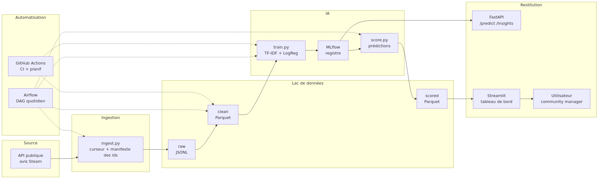

# ReviewPulse

[](https://github.com/KinSushi/reviewpulse-pipeline/actions/workflows/ci.yml)

**Un pipeline de données qui alimente un modèle d'IA** — Final Project de la formation Data Lead (Jedha, cohorte dal-ft-18), Demo Day du 25 septembre 2026.

Chaque jour, ReviewPulse collecte les avis Steam de plusieurs jeux, les dépose bruts dans un lac de données, les nettoie et les pseudonymise, puis un modèle de sentiment suivi dans MLflow repère les avis négatifs à lire en priorité. Une API et un tableau de bord restituent le résultat à l'équipe community & live-ops.



## État mesuré au 20/09/2026

| Mesure | Valeur | Preuve |
|---|---|---|
| **F1 macro**, test 100 % naturel tenu à l'écart | **0,8027** — champion en service, version 5 | registre MLflow, barrière de promotion |
| AUC · rappel des négatifs · précision | 0,940 · 0,650 · 0,633 | même run |
| **Batterie de tests** | **131 verts** | `docs/evidence/` |
| **Tests inverses** | **26 mutations sur 26 tuées, 0 survivante** — en **un seul passage**, sur un runner GitHub | exécution CI `35523148761` |
| Porte de qualité silver et gold | **4 suites, 29 attentes, 0 échec** | `docs/evidence/dag_execution_reelle.md` |
| DAG quotidien, **exécuté en réel** | **9 tâches** : 8 vertes, 1 sautée par conception | même preuve |
| Test de la stack déployée | 16 contrôles sur 16 | `docs/evidence/forward_test.md` |
| Essai de charge | **0 % d'erreur**, 29,3 req/s, p99 925 ms | `docs/evidence/essai_charge.md` |

*Le p99 à 925 ms est mesuré **à chaud**. Le premier appel après démarrage porte le chargement du
modèle : 5 874 ms. Annoncer l'un sans l'autre serait trompeur.*

Point de reprise : [`docs/19_known_good.md`](docs/19_known_good.md).

## Historique — mesures du 16/09/2026 (données réelles, stack Docker déployée)

| Mesure | Valeur |
|---|---|
| Avis naturels collectés | 6 000 (3 jeux × anglais et français) ; **0 nouvel avis** au passage suivant (idempotence) |
| Avis négatifs complémentaires (entraînement seulement) | 2 797 bruts → 2 254 après dédoublonnage |
| Part d'avis négatifs (distribution naturelle) | 9 % |
| **F1 macro, test 100 % naturel tenu à l'écart** | **0,807** au 16/09 ; **0,797** au 19/09 sur un jeu élargi par l'ingestion (barrière de promotion 0,75) |
| F1 macro hors-plis (validation croisée 5 plis) | 0,802 |
| AUC classe négative | 0,948 |
| Rappel / précision des négatifs | 0,639 / 0,657 |
| Seuil de décision (choisi par validation croisée) | 0,75 |
| Cohérence métier : part négative prédite ÷ réelle, par jeu et langue | 0,79 à 1,21 |
| Tests automatisés | 48 au 16/09 ; **73 au 19/09**, lint propre |
| **Tests inverses** (défauts injectés) | 13 / 13 au 16/09 ; **16 / 16 au 18/09**, dont trois mutations Spark et Iceberg, chacun par un test nommé ; mesure témoin réussie → [`docs/evidence/reverse_tests.md`](docs/evidence/reverse_tests.md) |
| **Test de la stack déployée** | 12 / 12 au 16/09 ; **14 / 14 au 18/09** (contrôles Iceberg F7 et F8 ajoutés) (API, tableau de bord, MLflow, idempotence, qualité, confidentialité, cohérence métier) → [`docs/evidence/forward_test.md`](docs/evidence/forward_test.md) |
| Essais manuels en conditions réelles | tableau de bord piloté dans un navigateur ; DAG Airflow quotidien (3 exécutions) et hebdomadaire (1) réussis |

*Mesures du 20/09/2026, sur le même arbre : **131 tests verts**, **9 tâches** du DAG quotidien exécutées **en réel** (8 vertes, 1 sautée par conception), **4 suites de qualité** sur silver et gold (**29 attentes, 0 échec**), **26 mutations sur 26** tuées, **16 contrôles sur 16** au test de la stack, et un essai de charge à **0 % d'erreur**, 29,3 requêtes par seconde, p99 925 ms. Le champion en service est la **version 5**, F1 macro **0,8027**, retenue après un réglage mesuré des hyperparamètres et **promue par la barrière**, qui a refusé le même jour un modèle à l'ancienne valeur. Le détail vit dans `docs/evidence/` et le point de reprise dans `docs/19_known_good.md`.*

*Avant l'ajout des avis négatifs complémentaires, le même test donnait F1 0,750 et AUC 0,896 ; le détail de la décision est dans la charte et le contrat de code.*

## Démarrer

```bash
cp .env.example .env        # puis définir REVIEWPULSE_SALT
make install                # Python 3.11
make pipeline               # ingest → transform → train → score
make api                    # http://localhost:8000/docs
make dashboard              # http://localhost:8501
```

Ou tout en conteneurs :

```bash
make up                     # MLflow :5000, API :8000, tableau de bord :8501
make jobs                   # une exécution complète de la chaîne
make airflow                # Airflow :8080, DAG reviewpulse_daily
```

Produire les preuves (tests, tests inverses, test de la stack déployée) :

```bash
make evidence               # rapports datés dans docs/evidence/
```

## La chaîne

| Étape | Module | Ce qu'il garantit |
|---|---|---|
| Ingestion | `src/reviewpulse/ingest.py` | objets reçus écrits **inchangés** ; idempotence par manifeste ; reprise sur 429 et 5xx |
| Transformation | `src/reviewpulse/transform.py` | dédoublonnage, nettoyage, types, **pseudonymisation HMAC**, rétention 30 jours |
| Qualité | `src/reviewpulse/quality.py` | contrôles **bloquants** avant la zone propre (liste : ADR 0005) |
| Décision | `src/reviewpulse/decision.py` | **seule** définition de la convention d'étiquettes et du seuil (ADR 0009) |
| Modèle | `src/reviewpulse/train.py` | TF-IDF caractères + régression logistique, MLflow, promotion automatique si F1 macro ≥ 0,75 |
| Score | `src/reviewpulse/score.py` | prédictions et résumé quotidien, version du modèle tracée |
| API | `src/reviewpulse/api.py` | `/health`, `/predict`, `/insights` ; 503 si modèle indisponible |
| Tableau de bord | `dashboard/app.py` | aucune information d'auteur affichée |
| Orchestration | `dags/reviewpulse_daily.py`, `.github/workflows/` | exécution quotidienne, réentraînement hebdomadaire, CI |

## Documentation

| Document | Contenu |
|---|---|
| [`docs/14_plan_monitoring.md`](docs/14_plan_monitoring.md) | Plan de monitoring : fraîcheur, qualité, dérive, performance ; ce qui est en place et ce qui reste à construire |
| [`docs/13_note_orientation.md`](docs/13_note_orientation.md) | Note d'orientation technologique : options essayées et mesurées, latence, sécurité, veille |
| [`docs/12_model_card.md`](docs/12_model_card.md) | Model Card : usage prévu, données, modèle, évaluation, limites, données personnelles, traçabilité |
| [`docs/16_registre_suivi.md`](docs/16_registre_suivi.md) | **Registre de suivi** : ce qui reste dû, avec critère de fin, preuve et prochaine action |
| [`docs/15_reversibilite.md`](docs/15_reversibilite.md) | Revenir en arrière : ce qui est réversible, par quel moyen, et ce qui ne l'est pas |
| [`docs/05_conformite_demo_day.md`](docs/05_conformite_demo_day.md) | **Conformité au Demo Day** : les cinq exigences non négociables, et pourquoi le projet répond aux **deux** énoncés, v1 et v2 |
| [`docs/presentation/discours_demo_day.md`](docs/presentation/discours_demo_day.md) | **Le discours du Demo Day**, mot pour mot : dix minutes, le raisonnement dit à voix haute, démonstration comprise |
| [`docs/23_standard_agents.md`](docs/23_standard_agents.md) | **Standard de production** : ce que tout agent délégué doit respecter, et le défaut réel qui a produit chaque règle |
| [`docs/22_runbook_deploiement.md`](docs/22_runbook_deploiement.md) | **Runbook de déploiement** : de zéro à une pile qui répond, durées mesurées et pièges de la machine |
| [`docs/21_guide_api.md`](docs/21_guide_api.md) | **Guide de l'API** : les quatre points d'accès, leurs entrées, leurs sorties, un exemple `curl` par point |
| [`docs/20_rapport_donnees.md`](docs/20_rapport_donnees.md) | **Jeu de données et prétraitement** : d'où viennent les avis, ce qui en est retiré, et pourquoi |
| [`docs/17_gouvernance.md`](docs/17_gouvernance.md) | Dossier de gouvernance : politique, rôles, mise en œuvre, conformité — et ce qu'il ne démontre pas |
| [`docs/18_briques_exigees.md`](docs/18_briques_exigees.md) | Les briques exigées par les référentiels, classées une par une ; `make briques` refuse qu'une seule manque à l'appel |
| [`docs/08_exigences_par_bloc.md`](docs/08_exigences_par_bloc.md) | Les exigences, bloc par bloc, telles que les référentiels les écrivent |
| [`docs/11_reprise.md`](docs/11_reprise.md) | **À lire en premier pour reprendre le travail** : emplacements, état vérifié, blocages, étapes de reprise, règles |
| [`docs/09_journal_de_bord.md`](docs/09_journal_de_bord.md) · [`docs/10_backlog.md`](docs/10_backlog.md) | Journal daté et sourcé ; travail restant par sprint |
| [`docs/01_charte.md`](docs/01_charte.md) | Charte d'une page : utilisateur, décision, données personnelles, hors périmètre |
| [`docs/02_architecture.md`](docs/02_architecture.md) | Architecture et justification des choix |
| [`docs/03_matrice_reemploi_blocs.md`](docs/03_matrice_reemploi_blocs.md) | Ce que le projet apporte à chaque bloc CDSD et AIA |
| [`docs/04_plan_jusqu_au_demo_day.md`](docs/04_plan_jusqu_au_demo_day.md) | Calendrier et déroulé de la démo |
| [`docs/05_conformite_demo_day.md`](docs/05_conformite_demo_day.md) | Grille de conformité aux consignes |
| [`docs/06_carte_des_modules.md`](docs/06_carte_des_modules.md) | Où, quoi, comment, pourquoi : chaque module |
| [`docs/07_questions_jury.md`](docs/07_questions_jury.md) | Questions probables du jury, réponses chiffrées et preuves |
| [`docs/adr/`](docs/adr/) | Douze décisions d'architecture, avec les mesures qui les motivent |
| [`docs/evidence/`](docs/evidence/) | Rapports datés : tests inverses, test de la stack déployée |
| [`docs/SPEC_CODE.md`](docs/SPEC_CODE.md) | Contrat de code |
| [`docs/diagrams/`](docs/diagrams/) | Dix schémas (sources Mermaid, SVG, PNG) |
| [`docs/00_sources/`](docs/00_sources/) | Consignes Jedha relevées sur la plateforme |

## Données et conformité

Source : API publique des avis Steam. Les identifiants de joueurs sont pseudonymisés dès la zone propre et les identifiants directs supprimés ; le sel est un secret obligatoire, sans valeur par défaut. Détail dans la charte et le schéma [07](docs/diagrams/png/07_gouvernance_donnees_personnelles.png).
