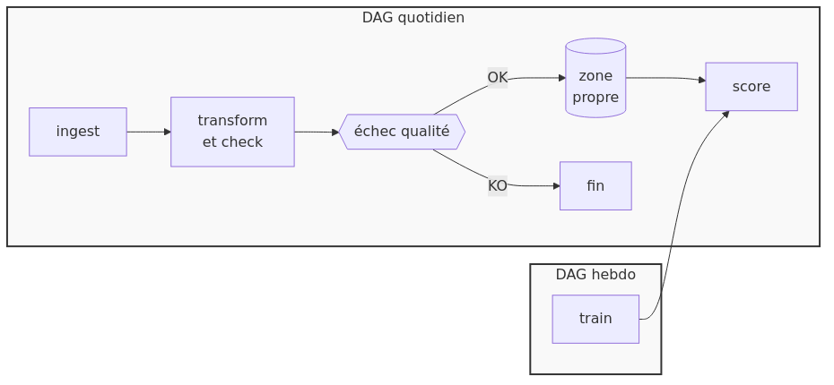
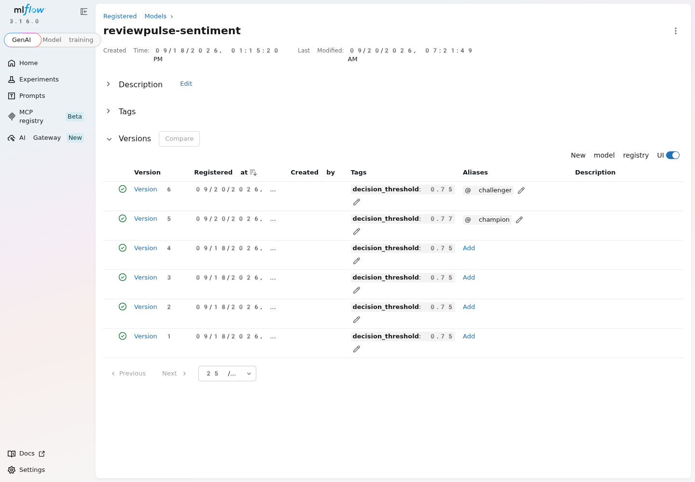
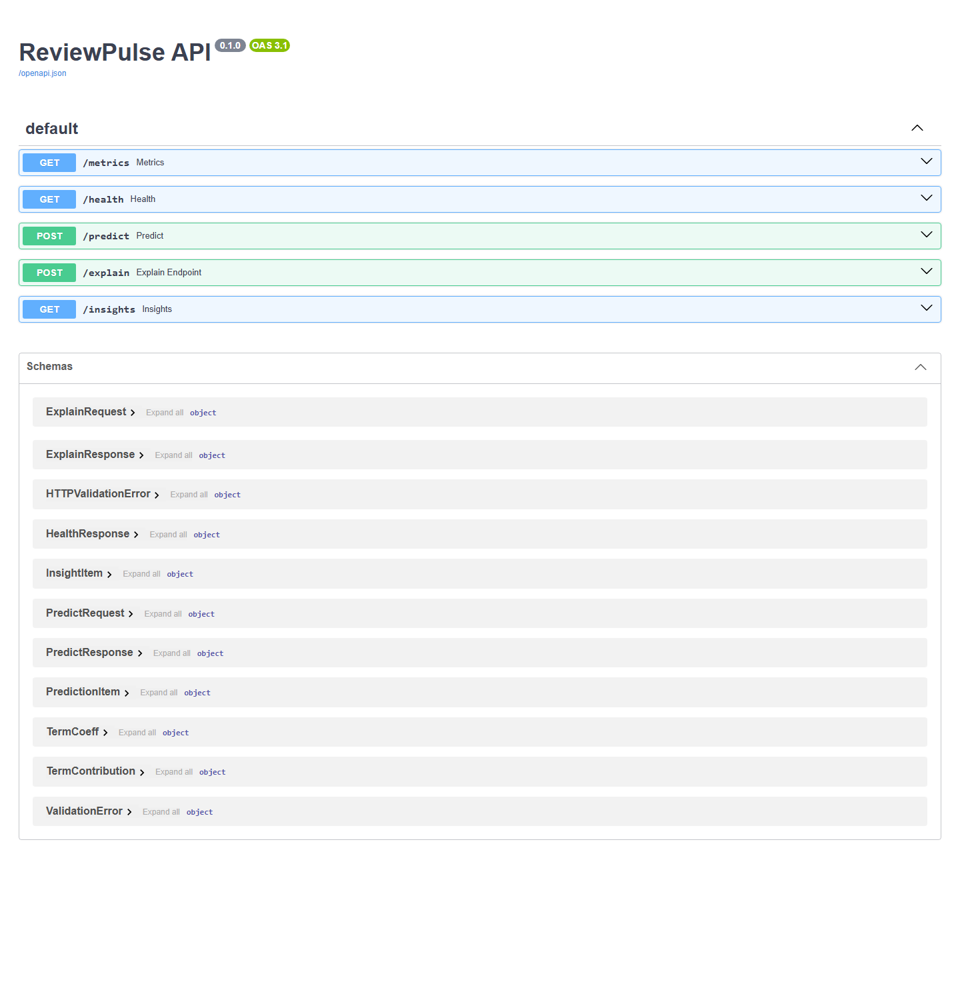
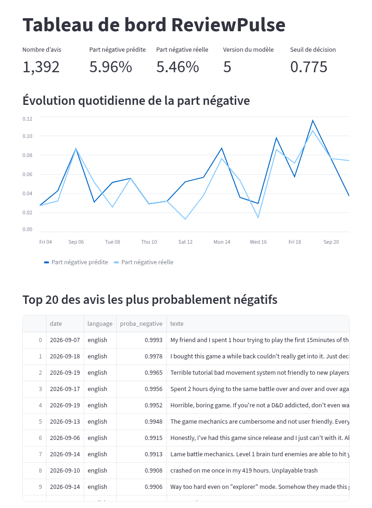

# ReviewPulse

[](https://github.com/KinSushi/reviewpulse-pipeline/actions/workflows/ci.yml)

**Chaque matin, les avis Steam négatifs qui comptent — triés, expliqués, et servis par une chaîne de données qui tourne sans moi.**

Final Project de la formation Data Lead (Jedha, cohorte dal-ft-18) — *Build a Data Pipeline That Feeds an AI Model* — Demo Day du 25 septembre 2026.

> *In short — a daily, orchestrated data pipeline (Steam reviews → immutable raw zone → Spark/Iceberg silver → dbt/DuckDB gold) feeding a sentiment model tracked in MLflow, served by a FastAPI endpoint and a Streamlit dashboard, with blocking data-quality gates, drift monitoring, rollback tooling, 144 automated tests and 27 mutation tests run in CI.*


---

## 1. Le problème, et pour qui

Un studio qui publie un jeu sur Steam reçoit des centaines d'avis par jour, dans plusieurs langues. Personne ne les lit tous. Quand un patch casse quelque chose ou qu'un prix passe mal, la note visible baisse pendant plusieurs jours avant que quelqu'un ne comprenne pourquoi.

| | |
|---|---|
| **Utilisateur** | la personne responsable de la communauté et du *live-ops* |
| **Décision servie** | chaque matin : quels retours négatifs remonter aux développeurs, sur quel jeu, dans quelle langue, en priorité |
| **Ce que « utile » veut dire** | un tableau de bord quotidien : part d'avis négatifs prédite par jeu et par langue, avis à lire en premier, termes qui pèsent dans la prédiction |
| **Seuil de mise en service** | F1 macro ≥ 0,75 sur un test tenu à l'écart — en dessous, le modèle n'est pas promu |

Ces quatre lignes ont été écrites dans la [charte](docs/01_charte.md) **avant** la première ligne de code : une chaîne de données sans décision servie est un exercice technique, pas un produit.

## 2. Ce que fait la chaîne

Le DAG Airflow `reviewpulse_daily` s'exécute tous les jours à 6 h. Neuf tâches, dans cet ordre :



| # | Tâche | Module | Ce qu'elle garantit |
|---|---|---|---|
| 1 | `ingest` | [`ingest.py`](src/reviewpulse/ingest.py) | chaque objet reçu de l'API est écrit **inchangé** dans la zone brute ; un manifeste d'identifiants rend le second passage **sans doublon** ; reprise sur 429 et 5xx |
| 2 | `spark_silver` | [`spark_silver.py`](src/reviewpulse/spark_silver.py), [`lakehouse.py`](src/reviewpulse/lakehouse.py) | dédoublonnage, nettoyage du BBCode, typage, **pseudonymisation HMAC-SHA256 salée**, écriture dans une table **Iceberg** : chaque écriture est un instantané restaurable |
| 3 | `gx_validate` | [`expectations.py`](src/reviewpulse/expectations.py), [`quality.py`](src/reviewpulse/quality.py) | porte de qualité **bloquante** (Great Expectations) : la chaîne s'arrête si un pseudonyme n'a pas le bon format ou si un contrôle échoue |
| 4 | `score` | [`score.py`](src/reviewpulse/score.py), [`decision.py`](src/reviewpulse/decision.py) | le champion MLflow score les avis ; le seuil voyage **avec le modèle** ; la convention d'étiquettes n'a qu'une seule définition |
| 5 | `drift` | [`drift.py`](src/reviewpulse/drift.py) | dérive mesurée (PSI) à chaque passage ; une alerte datée est écrite **hors du journal** quand un seuil est franchi |
| 6 | `gold` | [`gold.py`](src/reviewpulse/gold.py), [`dbt/`](dbt/) | modèles **dbt** sur DuckDB, 30 tests déclarés dans les contrats |
| 7 | `gx_lake` | [`expectations_lake.py`](src/reviewpulse/expectations_lake.py) | seconde porte bloquante, sur les zones silver et gold : 4 suites, 29 attentes |
| 8 | `derive_exige_reentrainement` | DAG | branche : ne continue que si la dérive dépasse le seuil |
| 9 | `declencher_reentrainement` | DAG | déclenche `reviewpulse_weekly_train` (entraînement, barrière de promotion, score, gold) |

Le même code tourne aussi hors Airflow (`make pipeline`), dans un conteneur (`make jobs`) et dans GitHub Actions ([`pipeline.yml`](.github/workflows/pipeline.yml)) — sur un runner vierge, en repartant d'une zone brute vide.

## 3. Les données

| | |
|---|---|
| **Source** | API publique des avis Steam — des données **réelles**, avec leur désordre |
| **Périmètre** | 3 jeux (*Clair Obscur: Expedition 33*, *Baldur's Gate 3*, *ELDEN RING NIGHTREIGN*), anglais et français |
| **Volume** | 9 410 lignes brutes ; 9 % d'avis négatifs dans la distribution naturelle |
| **Zone brute** | immuable : jamais modifiée, tout peut être rejoué depuis elle |
| **Données personnelles** | l'identifiant Steam est pseudonymisé par HMAC-SHA256 **salé** (un hachage simple d'un identifiant court se casse par dictionnaire) ; pseudonyme, URL de profil et avatar sont supprimés dès la zone propre ; le sel est un secret obligatoire, sans valeur par défaut — sans lui, la chaîne refuse de démarrer |
| **Flux complémentaire** | des avis négatifs supplémentaires servent à l'**entraînement seulement**, jamais au test : le modèle n'est pas mesuré sur une distribution gonflée |

Détail : [rapport sur les données](docs/20_rapport_donnees.md) · [schéma des données personnelles](docs/diagrams/png/07_gouvernance_donnees_personnelles.png).

## 4. Le modèle — et pourquoi pas un LLM

Classer un avis en positif ou négatif est une tâche de tri supervisée, sur un texte court, **déjà étiqueté par la plateforme**. Un classifieur linéaire la résout, s'explique terme par terme, se réentraîne en quelques secondes et ne coûte rien à servir. Un LLM ajouterait de la latence, un coût et une approximation — pour un problème qui n'en a pas besoin.

| Variante mesurée | F1 macro (test naturel tenu à l'écart) | Décision |
|---|---|---|
| Mots, 1 à 2 grammes | 0,735 | refusée par la barrière (< 0,75) |
| Régularisation ajustée | 0,756 | |
| Caractères, 2 à 5 grammes | 0,759 | robustes aux fautes et aux variantes d'écriture |
| + flux d'avis négatifs à l'entraînement | 0,797 | |
| + réglage des hyperparamètres (12 points, validation croisée 5 plis) | **0,803** | **champion en service, version 5** |

**En service** : TF-IDF caractères (2, 5) + régression logistique · F1 macro **0,8027** · AUC **0,940** · rappel des négatifs **0,650** · précision 0,633 · seuil de décision **0,775**, appris par validation croisée et non fixé à 0,5.



Le modèle est suivi dans **MLflow** : alias `champion` et `challenger`, **barrière de promotion** automatique, éprouvée dans les deux sens le même jour — elle a promu un modèle meilleur et refusé un modèle moins bon. Deux entraînements successifs donnent le même F1 à la seizième décimale : le code est déterministe, la seule source de variation est l'ingestion. → [Model Card](docs/12_model_card.md) · [réglage des hyperparamètres](docs/evidence/reglage_hyperparametres.md).

## 5. Ce que l'utilisateur obtient

**Une API** (FastAPI) — cinq points d'accès, guide complet dans [`docs/21_guide_api.md`](docs/21_guide_api.md) :

| Point d'accès | Rôle |
|---|---|
| `POST /predict` | prédiction pour un ou plusieurs avis, avec la version du modèle et le seuil appliqué |
| `POST /explain` | les termes qui pèsent dans la prédiction — contributions **exactes** du modèle linéaire, pas une approximation |
| `GET /insights` | le résumé quotidien par jeu et par langue |
| `GET /health` | état du service et version du champion ; 503 si le modèle est indisponible |
| `GET /metrics` | latences p50, p95, p99 par point d'accès — répond même sans modèle chargé |



**Un tableau de bord** (Streamlit) : part négative prédite contre part réelle, par jeu et par langue ; avis à lire en premier ; termes qui pèsent ; test d'un avis saisi à la main. Aucune information d'auteur n'y est affichée.



*Captures réelles de la pile qui tourne, reproductibles par [`tools/capture_ecrans.js`](tools/capture_ecrans.js). La première capture du tableau de bord, le 21/09/2026, affichait « version du modèle 2 » alors que le champion était la version 5 : les scores sur disque dataient d'avant la promotion. C'est une capture, pas un test, qui l'a trouvé ; le DAG quotidien a été rejoué, et l'écran ci-dessus en est le résultat.*

## 6. Comment je sais que ça marche

Un chiffre seul ne vaut rien ; chaque ligne ci-dessous nomme sa preuve.

| Preuve | Résultat | Où |
|---|---|---|
| Batterie de tests | **144 verts**, en intégration continue | onglet [Actions](https://github.com/KinSushi/reviewpulse-pipeline/actions) |
| **Tests inverses** : un défaut volontaire est injecté (pseudonymisation supprimée, convention de décision inversée, barrière de promotion retirée…) et un test **nommé** doit le détecter | **27 mutations sur 27 tuées**, en un seul passage, sur un runner GitHub | [`tests/reverse/mutations.json`](tests/reverse/mutations.json) |
| Test de la pile déployée (services réellement levés par `docker compose`) | **16 contrôles sur 16** | [`docs/evidence/forward_test.md`](docs/evidence/forward_test.md) |
| Portes de qualité silver et gold | 4 suites, 29 attentes, 0 échec | [`docs/evidence/dag_execution_reelle.md`](docs/evidence/dag_execution_reelle.md) |
| DAG quotidien exécuté **en réel** | 9 tâches : 8 vertes, 1 sautée par conception (la dérive était sous le seuil) | même preuve |
| Chaîne entière sur un runner vierge, zone brute vide | 5 798 avis collectés en direct, modèle entraîné et promu | [`pipeline.yml`](.github/workflows/pipeline.yml) |
| Essai de charge | 300 requêtes, **0 % d'erreur**, 29,3 req/s, p99 925 ms **à chaud** | [`docs/evidence/essai_charge.md`](docs/evidence/essai_charge.md) |
| Retour arrière | modèle (alias MLflow) et données (instantané Iceberg), outillés et testés | [`docs/15_reversibilite.md`](docs/15_reversibilite.md) |

*Le p99 à 925 ms est mesuré à chaud. Le premier appel après démarrage porte le chargement du modèle : 5 874 ms. Annoncer l'un sans l'autre serait trompeur.*

Le raisonnement derrière ces preuves — pourquoi des mutations, ce qu'est un témoin, ce que les tests **ne prouvent pas** — est dans les [questions du jury](docs/07_questions_jury.md#comment-le-projet-se-prouve).

## 7. Démarrer

Prérequis : Docker, `make`. Tout tourne en conteneurs.

```bash
cp .env.example .env        # puis définir REVIEWPULSE_SALT (secret obligatoire, aucune valeur par défaut)
make up                     # MLflow :5000, API :8000 (/docs), tableau de bord :8501
make jobs                   # une exécution complète de la chaîne
make airflow                # Airflow :8080, DAG reviewpulse_daily
```

Sans Docker (Python 3.11) : `make install`, puis `make pipeline`, `make api`, `make dashboard`.

Rejouer les preuves : `make test` · `make reverse` · `make forward` · `make evidence` (rapports datés dans `docs/evidence/`). Procédure détaillée, durées mesurées et pièges : [runbook de déploiement](docs/22_runbook_deploiement.md).

## 8. Le dépôt

```
src/reviewpulse/     le paquet : ingestion, silver Spark/Iceberg, qualité, modèle, score, dérive, gold, API
dags/                DAG Airflow quotidien et hebdomadaire
dbt/                 zone gold : modèles, contrats et tests dbt (DuckDB)
dashboard/           tableau de bord Streamlit
tests/               144 tests ; tests/reverse/ : les 27 mutations
tools/               campagne de preuves, test de la pile, essai de charge, contrôles de cohérence
docker/ · docker-compose.yml · Makefile
.github/workflows/   ci.yml (tests, lint, mutations) · pipeline.yml (chaîne entière, planifiée)
docs/                charte, architecture, 29 ADR, Model Card, preuves, supports de soutenance
```

Chaque module dit en tête **quoi, pourquoi, où, comment**, journalise ses étapes avec leurs chiffres, et commente ses choix avec l'alternative écartée. Ce texte a été ajouté sans toucher à la logique, et c'est prouvé : chaque fichier a franchi cinq portes mécaniques (syntaxe, citations ni perdues ni inventées, explication non appauvrie, **arbre syntaxique identique**, original conservé), elles-mêmes éprouvées par dix-huit témoins ([`tools/tester_portes.sh`](tools/tester_portes.sh)) ; un contrôle d'arbre garantit qu'aucun journal n'écrit un texte d'avis, un identifiant ou le sel ([`tools/verifier_journaux.sh`](tools/verifier_journaux.sh)). La carte d'ensemble : [`docs/06_carte_des_modules.md`](docs/06_carte_des_modules.md).

## 9. Décisions d'architecture

Vingt-neuf décisions sont écrites ([index](docs/adr/README.md)), chacune avec la mesure qui l'a motivée et l'alternative écartée. Les plus structurantes :

| Décision | En une ligne |
|---|---|
| [ADR 0004](docs/adr/0004-pseudonymisation.md) — pseudonymisation | HMAC salé plutôt que hachage simple ; sel obligatoire |
| [ADR 0005](docs/adr/0005-controles-qualite-bloquants.md) — qualité bloquante | une porte qui journalise sans refuser ne protège rien |
| [ADR 0009](docs/adr/0009-convention-de-decision.md) — convention de décision unique | un seul module définit étiquettes et seuil, après une inversion trouvée par le test de la pile |
| [ADR 0012](docs/adr/0012-deploiement-conteneurs.md) — pas de Kubernetes pour la démonstration | `docker compose` suffit ; Kubernetes est décrit comme cible |
| [ADR 0014](docs/adr/0014-spark-iceberg-silver.md) — Spark et Iceberg pour la zone silver | chaque écriture est un instantané : la réversibilité des données |
| [ADR 0019](docs/adr/0019-explicabilite-lineaire.md) — explicabilité exacte | contributions du modèle linéaire plutôt que SHAP ou LIME |
| [ADR 0029](docs/adr/0029-surveillance-de-la-latence.md) — latence | `/metrics` en mémoire, sans dépendance nouvelle |

## 10. Limites, et ce que je construirais ensuite

Dit comme des manques, pas comme un plan :

- **La mesure de biais par langue et par jeu manque.** L'AI Act la demande ; elle n'est pas faite.
- L'essai de charge est mesuré sur **une seule machine** ; rien ne prouve la tenue sous un trafic réparti.
- Le modèle n'a vu que l'anglais et le français, sur trois jeux.
- Le chemin « la dérive déclenche le réentraînement » est couvert par des tests, pas encore par une exécution réelle : la dérive n'a jamais dépassé le seuil.
- Ensuite : Kafka pour le temps réel, un stockage objet, Terraform, Kubernetes — chacun écarté par un ADR, avec la condition à laquelle il reviendrait.

## 11. Documentation

**Pour comprendre le projet** — [charte](docs/01_charte.md) · [architecture](docs/02_architecture.md) · [carte des modules](docs/06_carte_des_modules.md) · [Model Card](docs/12_model_card.md) · [rapport sur les données](docs/20_rapport_donnees.md) · [dix schémas](docs/diagrams/)

**Pour la soutenance** — [conformité à la consigne du Demo Day](docs/05_conformite_demo_day.md) · [diapositives](docs/presentation/ReviewPulse_DemoDay.pptx) · [discours, mot pour mot](docs/presentation/discours_demo_day.md) · [minutage](docs/presentation/script_10_minutes.md) · [questions du jury](docs/07_questions_jury.md)

**Pour exploiter** — [runbook de déploiement](docs/22_runbook_deploiement.md) · [guide de l'API](docs/21_guide_api.md) · [plan de monitoring](docs/14_plan_monitoring.md) · [réversibilité](docs/15_reversibilite.md) · [gouvernance](docs/17_gouvernance.md)

**Pour auditer** — [preuves datées](docs/evidence/) · [décisions d'architecture](docs/adr/) · [note d'orientation technologique](docs/13_note_orientation.md) · [contrat de code](docs/SPEC_CODE.md) · [journal de bord](docs/09_journal_de_bord.md) · [registre de suivi](docs/16_registre_suivi.md) · [point de reprise](docs/19_known_good.md)

<details>
<summary>Tous les documents numérotés</summary>

[`00_sources/`](docs/00_sources/) · [`01_charte.md`](docs/01_charte.md) · [`02_architecture.md`](docs/02_architecture.md) · [`03_matrice_reemploi_blocs.md`](docs/03_matrice_reemploi_blocs.md) · [`04_plan_jusqu_au_demo_day.md`](docs/04_plan_jusqu_au_demo_day.md) · [`05_conformite_demo_day.md`](docs/05_conformite_demo_day.md) · [`06_carte_des_modules.md`](docs/06_carte_des_modules.md) · [`07_questions_jury.md`](docs/07_questions_jury.md) · [`08_exigences_par_bloc.md`](docs/08_exigences_par_bloc.md) · [`09_journal_de_bord.md`](docs/09_journal_de_bord.md) · [`10_backlog.md`](docs/10_backlog.md) · [`11_reprise.md`](docs/11_reprise.md) · [`12_model_card.md`](docs/12_model_card.md) · [`13_note_orientation.md`](docs/13_note_orientation.md) · [`14_plan_monitoring.md`](docs/14_plan_monitoring.md) · [`15_reversibilite.md`](docs/15_reversibilite.md) · [`16_registre_suivi.md`](docs/16_registre_suivi.md) · [`17_gouvernance.md`](docs/17_gouvernance.md) · [`18_briques_exigees.md`](docs/18_briques_exigees.md) · [`19_known_good.md`](docs/19_known_good.md) · [`20_rapport_donnees.md`](docs/20_rapport_donnees.md) · [`21_guide_api.md`](docs/21_guide_api.md) · [`22_runbook_deploiement.md`](docs/22_runbook_deploiement.md) · [`23_standard_agents.md`](docs/23_standard_agents.md)

</details>
