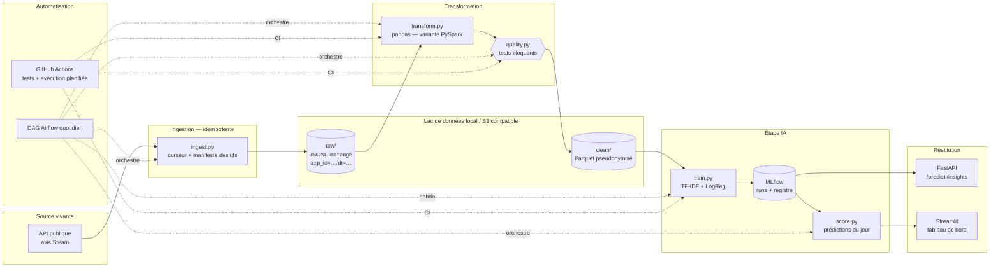

# ReviewPulse — architecture v1

## Les choix, et leur justification

| Choix | Pourquoi | Alternative écartée |
|---|---|---|
| Zone brute en JSONL **inchangé**, partitionné par jeu et par date | Exigence n° 2 de l'énoncé ; permet de rejouer la transformation | Écrire directement en table propre |
| Idempotence par manifeste des `recommendationid` | Relancer deux fois ne crée aucun doublon (exigence J1) | Dédoublonnage en aval seulement |
| pandas en production, PySpark en variante | Volume de quelques dizaines de milliers d'avis ; PySpark démontré pour le passage à l'échelle et pour les blocs qui l'exigent | Spark partout, coûteux au démarrage |
| Tests de qualité **bloquants** avant la zone propre | Exigence n° 3 ; une donnée fausse n'atteint jamais le modèle | Tests informatifs seulement |
| MLflow, registre et alias `champion` / `challenger` | Versioning automatisé et promotion contrôlée, compétence C4.1 de l'AIA | Fichier `.pkl` versionné à la main |
| Airflow pour le quotidien, GitHub Actions pour la CI et le secours planifié | Exigence n° 5 ; deux mécanismes, dont un indépendant de la machine locale | cron seul |
| Docker Compose, Python 3.11 | Même exécution partout ; le poste de développement est en Python 3.14, mal supporté par MLflow, Spark et Airflow | Environnement virtuel local |

## Ce que la chaîne doit permettre ensuite

Le modèle est **une boîte remplaçable**. Le contrat d'entrée (`clean/reviews.parquet`) et de sortie (`score`, `label`, `model_version`) ne change pas quand on remplace TF-IDF + LogReg par un modèle profond. C'est ce qui rend la chaîne réemployable pour les blocs 4 et 5 du CDSD : voir `03_matrice_reemploi_blocs.md`.
